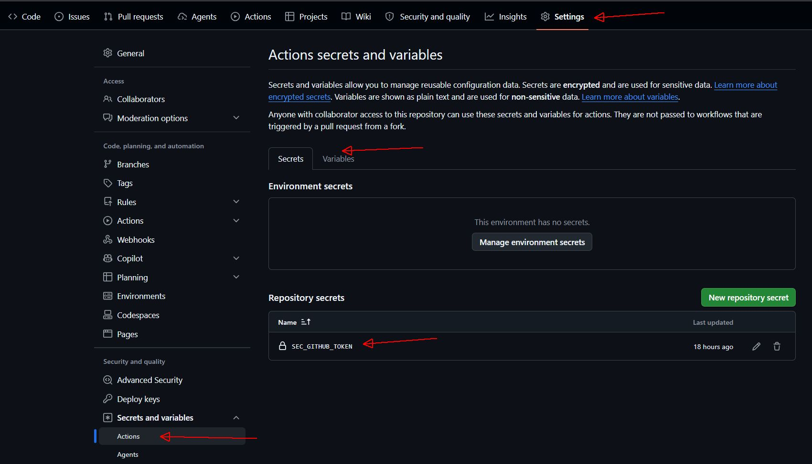

# terraform2github
## Scripts to extract, synchronize, and clone GitHub repository rules and contents
* These pipelines allow you to clone GitHub rules, branches, configurations and even repository contents 
* You can use to have a valid repository template to create new ones or update the existents
* This script covers the cloning of the following configurations:
  - Repository (and optionally the contents)
  - Variables per repository
  - Secrets per repository
  - Environments
  - Environment rules
  - Variables per environment
  - Secrets per environment
  - Branches
  - Branch Protection (partial)
---

## Folder Structure
* README.md - this file
* .github/workflows/extract.yml - Pipeline to extract general GitHub data for analysis
* .github/workflows/run_terraform.yml - Pipeline to extract, create, and apply repository Terraform configurations
* extract.sh - Bash script to extract GitHub information using REST API
* functions.sh - Helper functions used by the scripts
* repos/<repo_name> - Directory containing the project scripts created by the Terraform pipeline
* repos/<repo_name>/main.tf - Main Terraform script generated by the pipeline to apply configurations to GitHub
* repos/<repo_name>/secret.tf - Parameterized file with secrets to inject values using pipeline or env variables
* repos/<repo_name>/import.tf - Import commands generated by the pipeline to recover tfstate files from existing repositories
* assets/* - README.md images and other stuff 
---

## Configuring pipeline

Below are the steps to set up a new repository in your organization or user account to run it.

1. Create new target repository and clone terraform2github repo
```
#!/usr/bin/bash
source_user=joaovalle71
source_repo=terraform2github
# target user and repo must exists
target_user=joaovalle71
target_repo=teste01
#
# clone main only
git clone --branch main --single-branch --depth 1 https://github.com/${source_user}/${source_repo}.git
cd ${source_repo.git}
git remote set-url origin https://github.com/${target_user}/${target_repo}.git
git push -u origin main
```

2. Configure new repository secret and variables
Create or use a github token for your user on [https://github.com/settings/tokens](https://github.com/settings/tokens) and use it to configure secrets
    &nbsp;&nbsp;&nbsp; - SEC_GITHUB_TOKEN: \<your github admin token\>
    &nbsp;&nbsp;&nbsp; - TERRAFORM_VERSION: 6.13.0
    &nbsp;&nbsp;&nbsp; - VAR_GITHUB_AGENT: ubuntu-latest or self-hosted
 


3. Run pipeline


## Extract
You can use this script to extract data from github to inspect it. It generates .txt as variables to use in bash and .tsv files to open in excel.
1. Choose the execution parameters
 * Branch - Branch where the pipeline will run; can remain on main
 * Extract global variables - Extracts corporate level data
 * Repository - Extracts data from a specific repository or all repos
 * Clone Repo contents to NEW destination? - WARNING! It will overwrite you destination repository contents with source
 * Debug? - Increases debugging verbosity
2. Check the execution output in pipeline attachments

---
## TERRAFORM Execution
1. Create a working branch from main to store your execution runs
2. Select your new working branch to run the pipeline
  * Branch - Working branch where the pipeline execution will run and target its output
  * SOURCE Repository - Must be an existing repository (for extraction) or the folder in repos/<repo_name>/main.tf must exist to allow Terraform execution
  * DESTINATION Repository - Will target the extraction execution to a DESTINATION folder, placing the destination repository name inside main.tf. Attention! This will overwrite existing configurations in the DESTINATION folder. This function allows CLONING existing repository configurations under a different name.
  * Create main.tf script - Runs extraction to create a new Terraform configuration file (main.tf and secret.tf) based on the source repository (which must exist)
  * Create import.tf script - Runs extraction to create a new import.tf file to load existing state. It will run on the DESTINATION repo if the cloning information is populated and the DESTINATION repo exists, thus merging configurations with the SOURCE.
  * Terraform Plan - Runs Terraform INIT and PLAN to analyze the execution plan
  * Terraform Apply - Applies the Terraform configurations
  * Clone Repo contents to NEW destination? - WARNING! It will overwrite you destination repository contents with sources
  * Debug? - Increases debugging verbosity
3. Check the execution result in your branch's /repos folder or, in case of error, check the pipeline logs and attached files
4. Upon successful execution, open a pull request to merge into the main branch to keep your configurations up to date

## Direct Configuration Management
The pipeline extracts repository data, generates the Terraform files, and allows you to manipulate and apply changes directly from the main.tf file
1. Run the repository extraction without applying changes (apply)
2. Make changes directly in the main.tf file and run plan only to validate your modifications
3. Run plan and apply to enforce your changes. Do not re-run extraction so you don't lose your custom modifications
---   

## SECRETS Injection
1. Source pipelines may contain secret variables (secrets) that are declared but not automatically cloned by the pipeline because this data is not exposed by the GitHub API. To ensure correct mapping, secrets must be created in this repository and mapped in the pipeline as shown in the example below.
  * All secrets are mapped through the secrets.tf file, generated and updated by the pipeline
  * REPOSITORY-level secrets are declared with the exact same name as the source
  * ENVIRONMENT-level secrets follow the pattern {ENVIRONMENT_NAME}_{SECRET_NAME}
  * Variables must be declared and mapped on pipeline yaml according. See the example below
---
